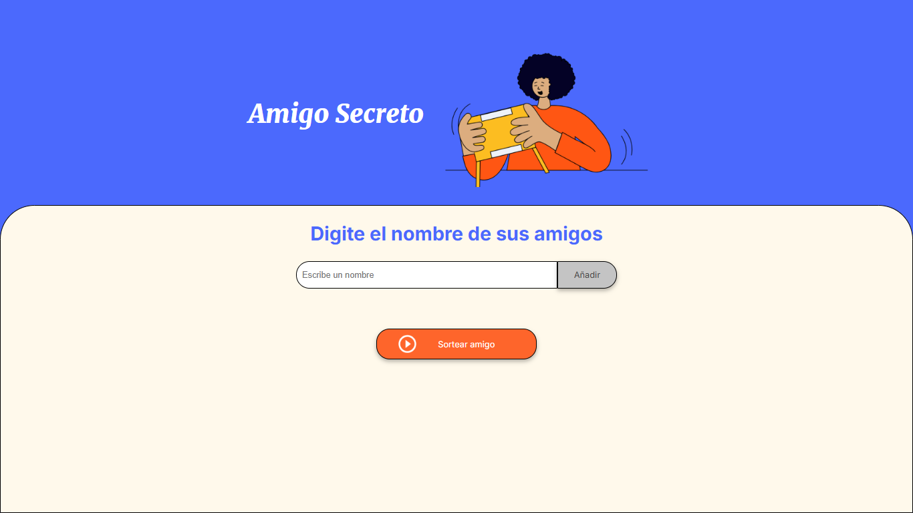
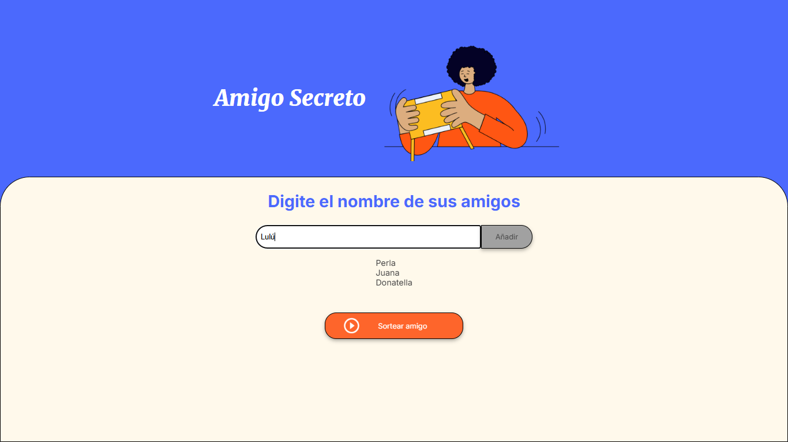
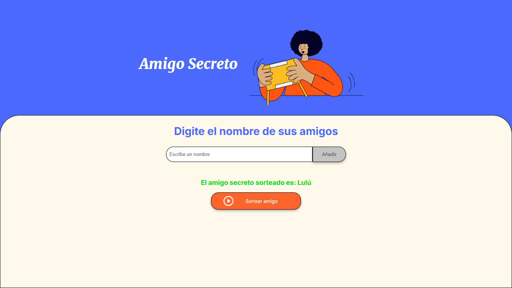

# 🎁 Amigo Secreto

!Bienvenido a **Amigo Secreto**! Una aplicación interactiva donde los usuarios agregar nombres de amigos y realizar un sorteo aleatorio para determinar quien es su "Amigo Secreto". 🎉

## 🚀 Funcionalidades

- Agregar nombres a la lista. ✍
- Mostrar los nombres ingresados. 📋
- Realizar un sorteo aleatorio. 🎲
- Mostrar el resultado en pantalla. 🏆

## 📸 Capturas de Pantalla

## 🚀 Paso 1: Iniciar la Aplicación  
Para comenzar, abre el archivo `index.html` en tu navegador. Deberías ver la siguiente interfaz:  

  

---

## 📝 Paso 2: Agregar Nombres  
Escribe un nombre en el campo de texto y haz clic en el botón "Adicionar".  

📌 **Ejemplo:** Agregando el nombre "Lulú".  

  

---

## 🎲 Paso 3: Realizar el Sorteo  
Después de ingresar todos los nombres, presiona el botón "Sortear Amigo" y verás el resultado en pantalla.  

---

🔨 Instalación

1. Clona el repositorio: 

      git clone https://github.com/Sapbri/challenge-amigo-secreto.git

2. Abre el archivo index.html en tu navegador.
3. !Disfruta!

🎯 Cómo usarlo

1. Ingresa "nombres" en el campo de texto.
2. Presiona el botón "Añadir" para agregar nombres.
3. Haz click en "Sortear Amigo" para ver el resultado.
4. Se mostrará en pantalla el nombre del amigo secreto.

🖥️ Tecnologías Usadas

- HTML5.
- CCS3.
- JavaScript.

📌 Contribuir

Si deseas mejorar esta aplicación, siéntete libre de hacer un **fork** y contribuir con mejoras. 🚀

